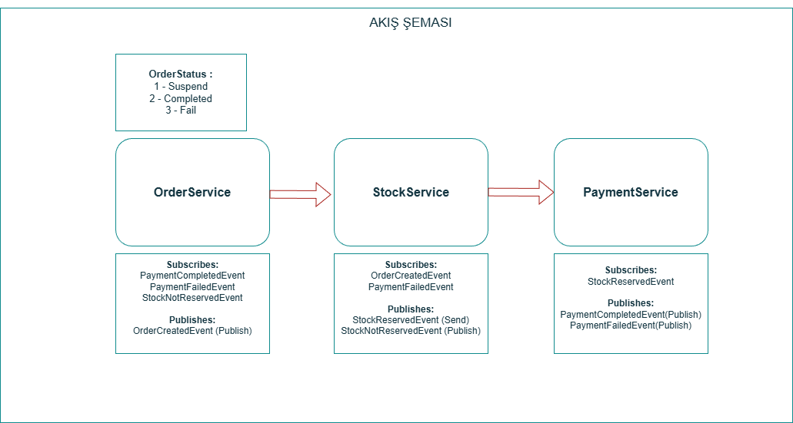

<h1>Choreography Design Pattern ile Mikroservislerde Transaction Yönetimi</h1>

<h1>1- Giriş</h1>
<p align="justify">Projede order, stock ve fakepayment mikroservisleri oluşturularak mikroservislerde transaction yönetimi, bununla beraber veri tutarlılığı asenkron bi şekilde sağlanmış olup, temiz bir mimari ve kodlama ile gerçekleştirilmiştir. </p>

<h3>2- Saga Pattern ve Choreography Tabanlı Saga Pattern Nedir?</h3>
<p align="justify">Saga design pattern, Mikroservisler arası veri tutarlılığını sağlamak için kullanılır. Birden fazla mikroservis arasında transaction yönetiminde kullanılır. Eğer tek bir veritabanı ile çalışılıyorsa burada kullanılan framework transaction yönetimini otomatik olarak yapmaktadır. Chreography Saga Pattern'da her bir mikroservis'in mutlaka bir en az bir subscriber ve publisher'ı olmalıdır. Saga’nın iki tane implementasyonu vardır, bu projede bunlardan biri olan Choreography Based Saga design pattern ile gidilmiştir.</p>

<p align="justify"><b>Choreography Based Saga </b></p>

<ul>

<li>Local transaction sırasını kullanarak bir transaction yönetimi sağlar. (yani her bir mikroservis kendi scope’u içerisindeki işlemleri gerçekleştirir. Başka mikroservislerin transactionlarını bilmez.)</li>
<li>2-4 mikroservis arasında bir distributed transaction yönetimi için uygun bir implementasyondur.</li>
<li>Sisteme katılan her bir katılımcı karar vericidir. (başarılı/başarısız)</li>
<li>İmplemente etmenin bir yolu asenkron messaging pattern kullanmaktır.</li>
<li>Her bir servis kuyruğu dinler, gelen event/message ile ilgili işlemi yapar, sonuç olarak başarılı veya başarısız durumunu tekrar kuyruğa döner</li>
<li>Point to point bir iletişim olmadığı için servisler arası coupling azalır.</li>
<li>Transaction yönetimi merkezi olmadığı için performans darboğazı azalır.</li>

</ul>

<h1>3- Akış Şeması</h1>


<h1>4- Projenin İşleyişi</h1>
<p align="justify">Projede Order, Stock ve Payment olmak üzere 3 tane mikroservis kullanılmıştır. Öncelikle Order mikroservisinden bir tane order oluşturulur ve ardından Order mikroservisinden mass transit framework'ü aracılığıyla rabbitmq exchange'ine bir OrderCreatedEvent publish edilir. Bu event'ı dinleyen StockAPI mikroservis'i bu event'ı consume eder. Eğer stok'da yeterli adet varsa stok'dan düşer ve StockReservedEvent'ı yayınlar. Ardından payment mikroservis'i bu event'ı consume eder ödemede bir sıkıntı yoksa PaymentCompletedEvent yayınlar, akabinde order mikroservis'i de bu event'ı dinler ve order'ın status'ünü completed'a çeker ve sipariş başarıyla tamamlanmış olur. Tabi burada stock'da ve payment'da bir takım hatalar olabilir.(örneğin; stok'da yeterli miktarda ürün yok veya ödemede bakiye yetersiz) Bu durumda yine ilgili consumer'lar bu event'ları yakalar, gerekli işlem yapılır(Örneğin; stoğun yetersiz olmasında siparişin iptali veya ödemede bakiye yetersiz ise düşülen stoğun tekrar eklenmesi ve siparişin iptali).</p>

<h1>5- Kullanılan Teknolojiler</h1>
<ul>
<li>Asp.Net Core Mvc 9.0</li>
<li>RabbitMQ - MassTransit</li>
<li>Asp.Net InMemory Cache</li>
<li>MSSQL</li>
<li>Ef Core 9.0</li>
<li>Microservices</li>
</ul>

### 6- Örnek API İstekleri

#### OrderAPI

**POST** `/api/orders`  
**Content-Type:** `application/json`

```json
{
  "buyerId": "4444",
  "payment": {
    "cardName": "test",
    "cardNumber": "test2",
    "expiration": "test3",
    "cvv": "112",
    "totalPrice": 100000
  },
  "orderItems": [
    {
      "productId": 1,
      "count": 99,
      "price": 1200
    }
  ],
  "address": {
    "province": "test4",
    "district": "test5",
    "line": "test6"
  }
}
```
## 7- Notlar
- StockAPI mikroservis'i ayağa kalktığında db'de hiç stok verisi yoksa örnek seed stok dataları gönderir.