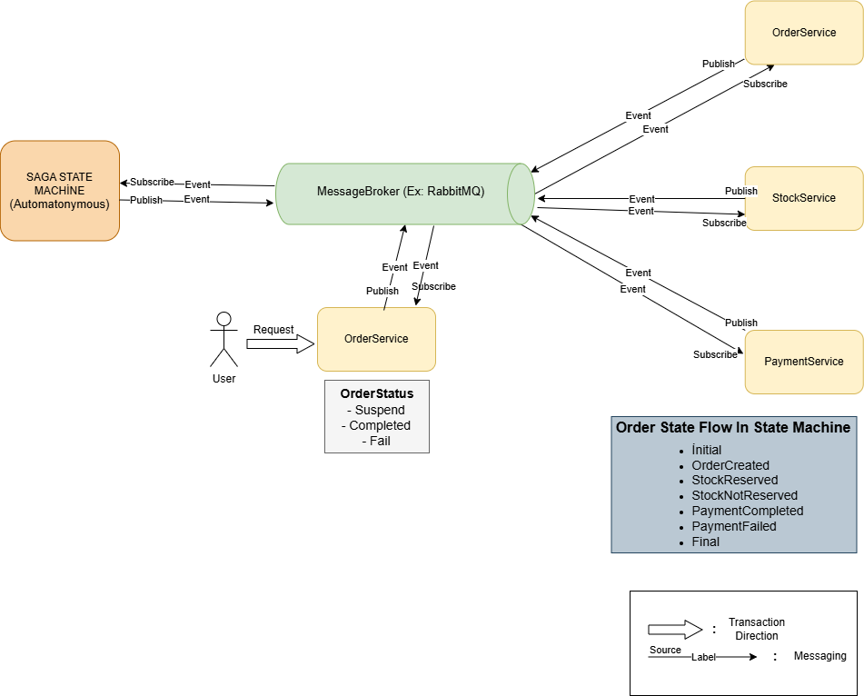

<h1>Orchestration Design Pattern ile Mikroservislerde Transaction Yönetimi</h1>
<h1>1- Giriş</h1>
<p align="justify">Projede mikroservislerde transaction yönetimini sağlamak adına saga pattern'ın bir diğer implementasyonu olan orchestration saga pattern'dan gidilmiştir. Order-Stock-Payment mikroservisleri arasındaki olay akışına oldukça önemli bir yapı olan state machine dahil edilerek bu mikroservisler arasındaki transaction yönetimi merkezi bir yerden yönetilmiştir. </p>

<h1>2- Orchestration Saga Pattern ve Özellikleri</h1>
<p align="justify">Orchestration saga pattern'da ilgili mikroservis sadece kendi compensable transaction’ını çalıştıracak event’ı dinler ve bu event gelirse yapmış olduğu transaction’ı geri alır ve yine gerekli fail event’ı message broker’a gönderir, saga state machine bu message broker’ı dinler, bu event geldiğinde gerekli mikroservislere ilgili eventlar’ı fırlatır. İlgili mikroservis gerçekleştireceği compensable transaction’a neyin sebep olduğunu ve hangi mikroservisden geldiğini bilmez, bu bilgi state machine’de tutulur. Mikroservisler birbirlerinin eventlar'ını dinlemez, state machine'den gelen event'a subscribe olurlar ve bunu dinlerler. Bu sayede choreography'deki gibi eventlar arasında taşınması zorunlu olan dataların taşınmasına gerek kalmaz, bu datalar state machine'de tutulur ve eventlarda sadece gerekli olan datalar taşınır. Orchestration pattern'da hangi durumda hangi event yayınlanacağı hangi event'dan sonra hangi event'ın yayınlanacağı bile kontrol edilebilir.

<ul>
<b>Özellikler :</b>

<li>Mikroservisler arası tüm transaction merkezi bir yerden yönetilir. (Saga State Machine)</li>
<li>4'den fazla mikroservis varsa uygun bir implementasyondur.</li>
<li>Transaction yönetimi merkezi bir yerden olduğu için performance bottleneck (darboğazı) fazladır.</li>
<li>İmplemente etmenin bir yolu asenkron messaging pattern kullanmaktır.</li>
</ul>

</p>

<h1>3- Akış Şeması</h1>

<h1>4- Projenin İşleyişi</h1>
<p align="justify"></p>

<h1>5- Kullanılan Teknolojiler</h1>
<ul>
<li>Asp.Net Core Mvc 9.0</li>
<li>RabbitMQ - MassTransit</li>
<li>MassTransit - Automatonymous(State Machine için)</li>
<li>Asp.Net InMemory Cache</li>
<li>MSSQL</li>
<li>Ef Core 9.0</li>
<li>Microservices</li>
</ul>

### 6- Örnek API İstekleri

#### OrderAPI

**POST** `/api/orders`  
**Content-Type:** `application/json`

```json
{
  "buyerId": "4444",
  "payment": {
    "cardName": "test",
    "cardNumber": "test2",
    "expiration": "test3",
    "cvv": "112",
    "totalPrice": 1200
  },
  "orderItems": [
    {
      "productId": 1,
      "count": 99,
      "price": 1200
    }
  ],
  "address": {
    "province": "test4",
    "district": "test5",
    "line": "test6"
  }
}
```

## 7- Notlar
- Projenin olay akışı bozulmamış olup base'i master branch'inden alınıp orchestration pattern uygulanmıştır. 